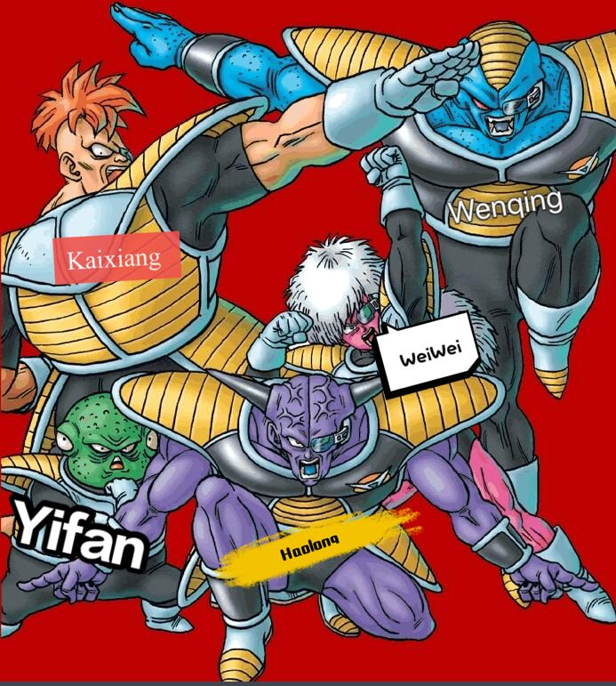

# Conclusion

In this final section, we will illustrate our app and what we have done. Firstly, we will reflect on our working practices, and clearly evaluate  our work. Then, We will come to the achievement of the project, with a focus on whether the brief and objectives were met. What's more, the influence of COVID-19 to our project will be demonstrated. Finally, we will discuss the social and ethical implications of our app and look ahead to future work in terms of design, development and evaluation.

## Working practices

In the previous section of Sprints & Project Management, we have shown our work practices in detail, here we will focus on our working practices.

###  Team organization
Because the members of our team have different strengths and interests, everyone was tasked with one responsibility or subsystem. In addition, each person is involved in system design and project sprints to ensure that everyone always understands what is happening and always keeps up to date with the project's skills and knowledge. All of above are particularly valuable in this difficult time.

Wenqing is a  careful and rigorous boy who likes to learn new technologies and he is responsible for designing the framework of the project, including data model, sequence and use case. HaoLong is devoted to becoming a front-end engineer, so he focus on designing the web page style and developing part of functions in front end. Both Yifan and Kaixiang are experienced back-end engineers and they collaborated with group members on the back-end development, which includes front-end API realization and Database, etc. Wei Wei has the least web experience, but he has the great ideas and excellent organizational and presentation abilities. He is mainly responsible for collecting information, making plans and writing the report. Despite this special period, our work are organized well and each group's member try his best to make the web app. More importantly, each member maximized his strengths !

### Management of issues
At first, we managed issues or subsystem requirements on Teams and Wechat. More specifically, we write the question as text and communicate on Wechat and Teams. However, we found that this issues management model can easily cause confusion. So Wei Wei is responsible for issues management. He if proficient with Trello and makes the checklists like "To Do", "In Progress", and "Done" to help us to keep track of the sprint progress. In addition, when performing agile sprints, weiwei can help us plan the tasks to be completed every week and communicate technical details to ensure that our backlog and sprints can be completed on time.
Therefore, we believe that having the project manager specifically responsible for management of issues is a good way to improve efficiency.

### Communication
Due to the pandemic of coronavirus, the team members were separated in different cities, and all of them out of Bristol. In order to effectively communicate and share information with each other, we decide to use the Team and the WeChat for discussing this project , as shown in the following two pictures.

.gif)

Microsoft Teams is a team collaboration tool that we are all familiar with. We have weekly meeting in our bubble more than once a week.

Wechat is a very popular chat software. It is also a daily chat tool used by our team members, so we will see wechat notice in time. 

Overall, good communication is very important. A meeting communication, even if it is only one hour (usually longer), can greatly improve the progress and completeness of the project. In our view, effective communication is the basis for the success of the group projects.

###  Agile Development
Our group undertook an Agile work-flow while completing our project. This allowed us to embrace changing requirements, and ensured that when our working methods had to become remote, we were prepared and did not fall behind. Agile Development can divide a project into multiple sub-projects that can be run, which enables us to quickly build the core functions of coursework. Help us in the next step of the development of non-core functions. Agile Development is willing to accept changes in requirements. Our team members are exposed to the design, development, testing and maintenance of a project for the first time. During the development phase, some of us have new ideas, and agile development can be more flexible to help realize our ideas. Agile Development is suitable for projects with short project cycles. In our plan, the project development time is 2 months, which is a very short time for us. Using agile development can help us improve efficiency and shorten the project cycle. Agile Development is more suitable for projects with a small number of team members and similar skill levels. 

In a word, for a five people team, agile development is our first choice.

## Success of Project

Overall we are proud of what we have achieved as a group since beginning this project. Now, we have delivered a working prototype of an idea we crafted in the early phase of this unit. In the past three months, our team worked together and every member learnt a lot about software engineering as well as how to work well in a group. Each of us is aware of the value of unity and cooperation -- only when each member can give full play to his own advantages can we make the excellent projects !

| No.  | objective                               | achieved or not | comments                                                     |
| ---- | --------------------------------------- | -------------- | ------------------------------------------------------------ |
| 1    | Build a full web application            | achieved        | We built a full web application with Angular,  Angular Material , Express, Node.js and MongoDB. |
| 2    | Make agile management plan              | achieved        | We used Jira as our agile development tool. There are 4 epics in Roadmap, which are front end, back end, API and document. And corresponding child issues have been added to these four epics. |
| 3    | Use Angular for front end               | achieved        | We used Angular to develop a complex and integrity front end.  We have eleven components include world map, cookbook, recipe, user, login, upload and feedback etc. |
| 4    | Use Angular Material and Echarts for UI | achieved        | We used some functional and decorative APIs in UI design. Angular Material was used to improve our layout and interface. Echart was used to draw a fascinating world map. |
| 5    | Design many features  for users         | achieved        | We designed and developed as much as possible of  features  for users includes login, uploading their own recipes , giving like to their favorite food , collecting  their feedbacks by questionnaire etc. |
| 6    | Use Express for Back end                | achieved        | We designed and implemented four APIs include recipe, nations, feedback and user to post and get request. |
| 7    | Use MangoDB for database                | achieved        | We managed to build a satisfactory database by MangoDB. Our data includes user information, recipes and nation was stored in it. |
| 8    | Deploy docker                           | achieved        | We deployed docker for our application, which made our application portable. |
| 9    | Evaluation our design                   | achieved        | We evaluated the app in three ways.  Unit testing, Functional testing, performance testing and User acceptance testing are adopted to the evaluation. |
| 10   | Preserve and share the recipes          | achieved        | Delicious food from various countries was saves and shares  in the app, which have a positive influence on convenience of people's life and the recording and diffusion of food culture. |

## Impact of COVID-19

The pandemic of COVID-19 in March, and the subsequent lockdowns running up to the end of April affected each us in many ways. 

  1. Communication inconvenience. Because the members of the group are located in different cities, we cannot conduct efficient face-to-face communication and we had to talk our work by **Microsoft Teams** . However, many technical-related details cannot be explained clearly only by online communication, which has brought a lot of trouble to our project. Every weeks we spend not less than 8 hours in communication , as we more and more understand each other , this difficulty was overcome finally. 

  2. Working Environment. Due to the severe COVID -19 epidemic, we could not go to the campus library to study together and we have no choice but to work in our homes separately. Unfortunately, the home environment is not suitable for work. Our team members often complain that the home is too noisy so that we can’t concentrate on work!

  3. Teaching support. Because all the courses in this semester are online teaching, we can't have face-to-face communication with professors and in-depth discussion of complex Internet technical details, so that we have to spend more time searching for related problem solutions on the website. This undoubtedly greatly increases our learning costs and reduces the efficiency and quality of our work.

  4. Infrastructure. Due to isolation from university infrastructure the team was heavily reliant on local machines and Internet being usable. Some team members' laptops are low in configuration. In addition, the Internet speed of the home is unstable, which brings great trouble to our work. What's more frustrating is that these hardware problems cannot be solved by our knowledge and usually we can only wait patiently for the system to run slowly , which makes us desperate.

 

## Social and ethical implications

In this part , we will focus on the aspect of social and ethical implications of our app.

In the previous part, we have talked about the social implications of the our product many times and I will simply repeat here. According to the  previous survey, we have learned that COVID-19 make a large number of people have to face unemployment ，financial crisis and spiritual crisis. Our product can teach people to cook their own meals according to the recipe and help these people who are suffering financial crisis reduce living cost, more importantly, the app encourage people to share their favorite recipes, which can promote people's communication, enrich people's spiritual world, and heal the mental trauma caused by the COVID-19.

Now,we will focus on the ethical implications of the product. Our product is a gourmet food and social app. As developers, we think that we have the responsibility to protect the privacy of every user. Last term, our computer science introduction's professor teach us that our products are supposed to protect the user's privacy,  which is a fundamental moral human right - a right that preserves autonomy and dignity which is of paramount importance when dealing with stakeholders. Therefore,we put customer privacy protection at an important position in the design of our products. In order to safely protect the privacy of users，we used the ‘The International Data Privacy Principles' (IDPPs) as the core guide to managing personal data.
At the same time, we fully consider the personal wishes of users. If users do not want us to keep their personal data, we will delete all private information in accordance with user requirements  at any time. In addition, we have adopted a variety of encryption methods and algorithms such as secure-sockets-layer (SSL) and MD5 algorithms to protect the data of our app. Although there are no bug-free apps in the world, we believe that through our strong tests, our products are capable of protecting users’ privacy from being leaked.

## Future work

Due to our time constrains, we rushed through big chunks in our project of what would be a normal design process and we have to admit that we skipped a lot of small content. In this part, we will plan future work to make our products more competitive. 

### Short term

Our product is still not perfect, but we can improve several relatively simple tasks in the short term.

####  A more attractive achievement system

Achievement system provides most of the **serious play** part in our product. We want to encourage people to try dishes from different regions through attractive achievement system. 

However, since the authentication part and the data storage part are complex, we don't have enough time to publish all functions we conceived. As you can see, for the time being, the achievement system (or accomplishment system) includes only records of uploaded recipes, liked recipes and completed recipes.

At the very beginning, we want to design several paths on the map. Users can follow the paths to finish required achievement. They may gather chef's hats by finish achievements, and hats can be used to unlock special (dark maybe) cuisine recipes.  So this funny achievements system can be our next step.

#### Better style

The style of our product also needs promotion.  We used Angular material but it takes a lot of time. Many contents still don't have a proper style for the time being. Bootstrap may help make our app more handsome.

####  **Stable and User-friendly Interaction**

Now some of our functions and interactions are not user-friendly enough. The alerts are not always display correctly.  After user finishes tasks, the app will not automatically jump to the proper page. 

We may add **Alert Component** and **Alert Service** to deal with all alerts of the app. Also,  we need to realize a better use of router to jump wisely.

### Long term

More excitingly, **Wei Wei** was an excellent student majoring in finance when he was a undergraduate and now he hopes to build a complete business model for our app. Therefore, as for the future work, he thinks there are some additional features that would make our product more viable, after analyzing the current apps of the same type. We may add **consumer market** and  **Social Network Service**.

#### Consumer market

In our commercial plan, users can use the special virtual currency we provide (hereinafter referred to as food coins) to purchase related goods. The goods that can be purchased by food coins include virtual good provided on our website, such as VIP privilege (the VIP users can enjoy exclusive discounts, exclusive titles and recipes and will be placed in a more prominent position on the website...) In addition, the goods also include real goods such as Kitchen furniture including Pressure Cooker, Insulate Food Container, Air Fryer and food materials including potatoes, broccoli, chicken breast,etc, which can be provided by the merchants cooperated with us. At this stage, there are two ways to obtain food coins. For the most ordinary users, they can get food coins by uploading recipes. In addition, uploading recipes that we require or uploading recipes that is liked by others can help users get more food coins, which can also encourage players to share interesting recipes with others and enhance the website’s user stickiness. What's more , for wealthy users, sharing recipes and completing designated tasks to earn food coins is not attractive enough. They could purchase it using real currency through our website, which make us have to develop a secure payment system using an existing online money transfer service like Pay-pal. Although these functions are not easy, it will bring us considerable benefits if we can complete them.

#### Social Network Service

Although we have implemented part of the social functions, we allow users to click the like bottom to other users' recipes, this is far from enough for a mature app. Therefore, in order to improve our social network service, we plan to add the following functions. First of all，we plan to allow users to comment on other user’s recipes and increase the friend function. Users who like similar recipes can become friends, discuss their favorite recipes with each other, and even meet in real life to try interesting new recipes together. In addition, we also plan to build an online communication community based on the needs of users for different recipes. Users can discuss specific recipes in their own communities. If there are many users interested in the same type of recipes, we will consider contacting an experienced chef to explain the recipe via video on our web.  In our research, social network functions are currently ignored by most food apps, so we believe that reliable social network services can become our unique advantage and build our core competitiveness. 

#### Profit (If any)

Our  profit model can be divided into three main categories: advertising insertion, e-commerce platform sharing, and selling ingredients.

Firstly, Inserting advertisements is a common way to make money on websites. When the users enter the APP, we plan to show an advertising image about 3 seconds. The content is usually a partner’s furniture goods or a meal advertisement. By the way, we don’t want to insert a variety of advertisements, we only intend to insert these advertisements related to our website app. What's more, other places for insert advertisements are the edge of the page. However, in order to ensure a good user experience, there will be not many advertisement spaces. Now, we are considering whether to insert a three-second advertisement every hour, because we are not sure whether this will reduce user satisfaction.

Secondly, e-commerce platform sharing plays an important role in our website app's profit. According to the plan above, our app has complete consumer market, Social Network Service, and interesting tasks and competition mechanisms. Therefore, our app have great commercial potential. Our cooperative manufacturers are mainly divided into two categories, high-level household kitchenware manufacturers and cheap tableware manufacturers. Through our own consumer market, consumers can use food coin to buy these products. At the same time, through our online community function, users can discuss the quality of goods with each other, recommend suitable products to each other. Simply, we provide convenience to users ,help cooperative manufacturers to sell products, and get profit.

Thirdly, we can earn profit by selling ingredients and we think this will  be brand new profit model. Usually, food ingredients suppliers buy ingredients from farmers and sell them to consumers to earn the difference between price. However, now we have a large number of users who have a large demand for ingredients, so we plan to skip suppliers and buy ingredients directly from farmers. This can simplify the purchase process and help our users reduce the cost of ingredients. Since our purchase volume far exceeds that of ingredients suppliers, there is no doubt that we can buy food at a lower price, and then we plan to sell ingredients to our users at a price lower than that of ingredients suppliers, so that we and the users both can get benefits.

Finally, this is a simple SWOT analysis : 

|                                                              | Strengths ：The profit model is novel and the team is young and energetic | Weaknesses ：Members have insufficient experience and lack of funds |
| ------------------------------------------------------------ | ------------------------------------------------------------ | ------------------------------------------------------------ |
| Opportunities   ：Internet users increase and rapid development of e-commerce | SO : According to the unique profit model and the advantages of low labor costs, quickly complete the initial capital accumulation and improve core competitiveness | WO : Use profit to recruit experienced Internet programmers to improve website quality and security, and attract strategic investment |
| Threats ：Malicious competition among website food application | ST : Recruit legal consultants to prevent malicious competition and malicious mergers and acquisitions, use the law to protect our rights. Improve our consumer market, Social Network Service,  tasks mechanisms and competition mechanisms to Enhance core competitiveness. | WT : Retain technical talents with common goals and dreams.  |

___