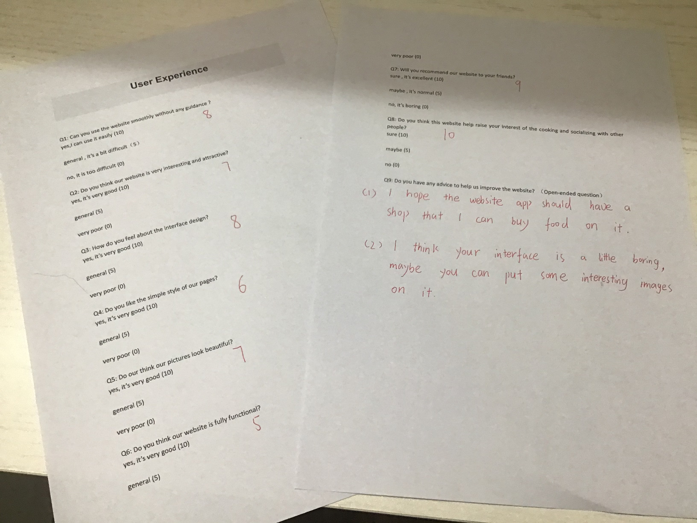
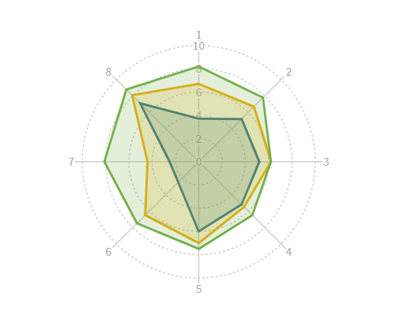
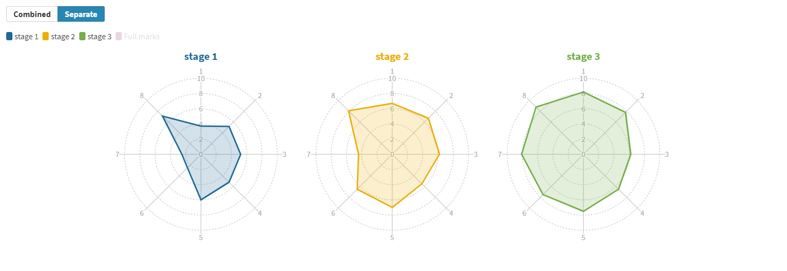

# Evaluation

## Testing

### **Function Testing** 

### Unit Testing

## User Experience Test Survey

Our user testing is mainly divided into three stages, as shown in the following table.

| stage | website process                                              | survey objective                                             |
| ----- | ------------------------------------------------------------ | ------------------------------------------------------------ |
| 1     | Preliminary completion of the website prototype with a few functions | Understand customer preferences, add functions and improve the website |
| 2     | The website is basically completed with more useful functions | Test the website for serious bugs from the user's perspective |
| 3     | The website has been fully completed                         | Find out the shortcomings of the website and plan solutions in future work |

###  Questionnaire design

we want users to comment on the real content and interface of the web application. We designed 8 scoring questions, requiring users to score each question. The higher score, the better user’s evaluation, and a reference scoring standard is given. In addition, we also designed an open-ended question to collect advice as well as complaints, in order to help us understand and analyze feedback from users.

The questionnaire is shown as below.

##### Q1: Can you use the website smoothly without any guidance ?

-   yes,I can use it easily (10)
    
-   general , it’s a bit difficult（5）
    
-   no, it is too difficult (0)

##### Q2: Do you think our website is very interesting and attractive?

-   yes, it's very good (10)
    
-   general (5)
    
-   very poor (0)

##### Q3: How do you feel about the interface design?

-   yes, it's very good (10)
    
-   general (5)
    
-   very poor (0)

##### Q4: Do you like the simple style of our pages?

-   yes, it's very good (10)
    
-   general (5)
    
-   very poor (0)

##### Q5: Do our think our pictures look beautiful?

-   yes, it's very good (10)
    
-   general (5)
    
-   very poor (0)

##### Q6: Do you think our website is fully functional?

-   yes, it's very good (10)
    
-   general (5)
    
-   very poor (0)

##### Q7: Will you recommend our website to your friends?

-   sure , it's excellent (10)
    
-   maybe , it's normal (5)
    
-   no, it's boring (0)

##### Q8: Do you think this website help raise your interest of the cooking and socializing with other people?

-   sure (10)
-   maybe (5)
-   no (0)

##### **Q9: Do you have any advice to help us improve the website? （Open-ended question）**

###  Feedback analysis

We get approximately 100 valid feedbacks from our users. The data of the testing result has been approximately rounded. The result is shown in the figure below.

##### 

 1. Obviously, with the increase of website functions and  the progress of website interface,  users’ satisfaction with our website is getting higher and higher.

 2. In the three stages, the question with the biggest change in score is question 6 (Do you think our website is fully functional?) and question 7 (Will you recommend our website to your friends), which means that no one will like a website that is too simple. With the gradual improvement of the website, people are very sensitive to the changes in the function of the website and will rapidly increase their favor-ability of the website.
 3. In the final stage, the question 3 (How do you feel about the interface design?) and the question (4) get the lowest score, which means our website interface design is relatively simple, and there are many point need to improve. We should beautify our interface design in future work.
 4. In every stage, question 8 (Do you think this website help raise your interest of the cooking and socializing with other people?) can get a high score. This is very exciting. This shows that, on the whole, our website has achieved the initial goal that help users raise interest of the cooking and socializing with other people.

### Conclusion on user testing

-   The majority of users think the web application is easy to explore and will introduce the web application to their friend.  This is a strong proof of the success of UX design.
- Our interface design is the shortcoming of the website and we should beautify our interface design in future work.
-   Users are more interested in feature-rich websites, we should add more interesting features.

The web application is originally designed to help users to raise interest of the cooking ,reducing live cost , and encourage users to socialize with other people.  Therefore, despite of some complaint about our UI design (we have try our best), we think it meets our initial expectations. We think our website application has a strong social significance and is very fun, which meets the project target that is “to design a playful web application but also to deal with serious problem”.