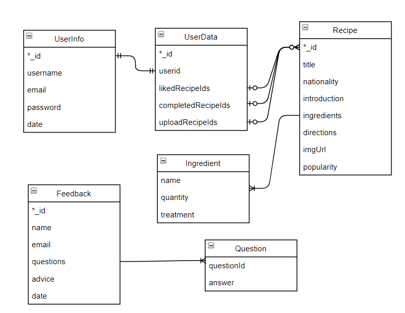
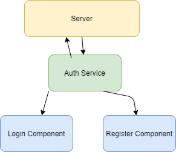
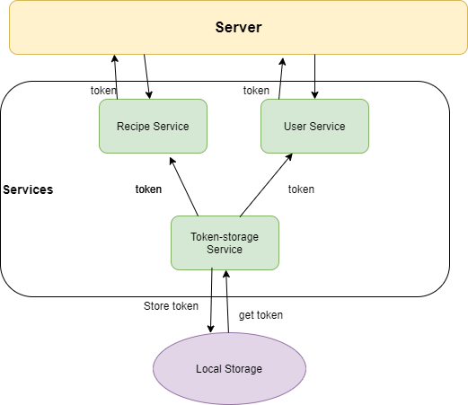
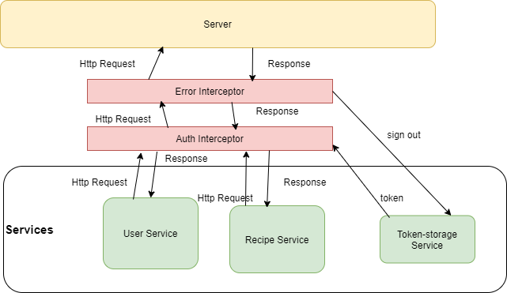

# System Implementation

## Stack architecture and system design

### Mean Stack

Our system apply the [MEAN](https://docs.docker.com/get-started/overview/) Stack.


The MEAN stack is a full-stack, JavaScript-based framework for developing web applications. MEAN stands for **M**ongoDB **E**xpress **A**ngular **N**ode, after the four key technologies that make up the different layers of the stack.

- MongoDB - document database
- Express(.js) - Node.js web framework
- Angular(.js) - a client-side JavaScript framework
- Node(.js) - the premier JavaScript web server


### System Design

#### Data Model


The fundamental part of our data model are **User** class and **Recipe** class. The **id** field of both classes are string type, compatible with database setting.

**User** class stores all information of users.

Field **Token** is an access token. It is used in authentication. After signing in, the user client can get an access token from the server. Whenever users want to access private data, the token will be added into header of HTTP Request, and the server will verify users' identification. 

For the sake of function separation and security, the User class contains three component classes:

| Class              | content                                            | function                   |
| ------------------ | -------------------------------------------------- | -------------------------- |
| UserProfile        | email                                              | Basic user information     |
| UserAccomplishment | likedRecipeId, completedRecipeId, uploadedRecipeId | User accomplishment system |
| UserCredential     | username, password                                 | Authentication             |

**UserProfile** class stores basic user information. For the time being, it only contains email of users. Other profile like address, phone number and portrait can be added in the future.

**UserAccomplishment** class is designed for accomplishment system, the "playing" part of this app. Users can try achieving all kinds of accomplishment and getting rewards. These accomplishment records are stored in this class.

**UserCredential** class is for Authentication. Data in this class will normally not be directly sent to client for security. It will mainly be use when users sign in their accounts.

**Recipe** Class contains all information to be shown in the Recipe Component and provide a guidance.  **ingredients** and **directions** will tell users what ingredients to prepare and how to deal with them. The **region** field provides a way to classify recipes by region, making the "Dish Map" available.

In order to realize a rank function, **likedNumber** and **completedNumber** fields are added.

#### Sequences

Without signing in, users can find and view recipes. 


The basic operations are like below:

1. **Open the web app:** a huge world map is displayed
2. **Click to select a specific region on the map** or **Click to select a region on the left navigation bar**: the webpage will jump to a cookbook, listing  recipes of that region
3. **click to select a recipe**: The detailed information of recipe (ingredients, directions and so on) will be shown 


After signing in, account-relevant operations are unlocked, including:

- **view and updating user profile**
-  **view accomplishment**
- **upload new recipes**
- **click "favor" button to like a recipe**
- **click "complete" button to complete a recipe**


#### Use Case

To sum up, the use case of our app is like below:


- View recipes on web
- Upload recipes
- Search recipes of a region
- Create user profile on web
- Like a recipe
- Complete a recipe
- Submit feedback

## Back End - database implementation

### Why MongoDB?

We use database MongoDB with Mongoose (for modeling) to provide a backend for our Node.js application.

MongoDB is an open-source document database built on a horizontal scale-out architecture. It has been around for more than 13 years and has been deployed at thousands of companies for a wide range of use cases. 

Instead of storing data in tables of rows or columns like SQL databases, each row in a MongoDB database is a document described in JSON, a formatting language which is human readable and natural form to store data. And it's very convenient to use Javascipt or Node.js for handling JSON. So MongoDB can be easily integrated into a Node/Express environment. 

Moreover It is a NoSQL database, which is great for scaling, fast queries and it makes life a lot simpler for developers. It's document data model is a powerful way to store and retrieve data that allows developers to move fast.  Thus, mongoDB will take less time to implement, and will offer similar (if not better) performance for the kinds of tasks and operations we are doing. 

### Data models



#### User Models

As shown in the data model diagram above, for the sake of data security, we store the informations and data of users separately. The userid in userdata model is used like the foreign key in mysql, which is used to determine which user the user data belongs to. 

**For security and privacy, we can't store the password directly into the database,** which will expose user's password to everyone who can access the database.  We use bcrypt, an adaptive hash function based on the Blowfish symmetric block cipher cryptographic algorithm, to encrypt the password. When a user registers, **we store his hashed password to the database.** When he login to our website, by comparing the hashed result of input password with the hashed password we stored in the database, we can verify whether the input password is correct.

```js
//generate salt and hash the password using salt when register
const salt = await bcrypt.genSalt(10);
const hashedPassword = await bcrypt.hash(req.body.password, salt);
```

```js
//validate the password when login
const validPassword = await bcrypt.compare(req.body.password, user.hashedPassword);
```

#### Recipe models

Users are able to upload the recipes by themselves. Recipe is also a json format data. One recipe should have at least one ingredient. Ingredient consists of name, quantity and treatment. For example, {name:"chicken thighs", quantity:"½ pounds", treatment:"boneless, skinless chicken thighs, cut into 1/2 inch cubes"}.

To record the accomplishments The _id of recipe is used when recording user's like/complete/upload operations. 

User can upload one picture file of the recipe. In http, the default post form is `application/x-www-urlencoded`, which is not suport for uploading files. **To support for uploading image, we use `multipart/form-data` and a middleware called `Multer`.**

#### Feedback models

Because the content of the feedback is designed ahead, the feedback model is relatively simple. When the content of our feedback design changes, we can easily evolve our documents, which is much easier when we use mongodb than mysql.

For our future work, we can design a feedback analysis system to visually analyze the feedback results. If we want to optimize our website further more, this step is very necessary.

### Schema

Mongoose provides a straight-forward, schema-based solution to model our application data. It includes built-in type casting, validation, query building, business logic hooks and so on. So we use this middleware to model our data.

We defined the schemas based on the data model diagram. We strictly check the data input from the user(both front-end and back-end). Take UserInfo Schema for example:

```js
const mongoose = require("mongoose");

var UserInfoSchema = new mongoose.Schema({
  username: {
    type: String,
    required: true,
    min: 6,
    max: 255,
  },
  email: {
    type: String,
    required: true,
    min: 6,
    max: 255,
  },
  password: {
    type: String,
    required: true,
    min: 6,
    max: 1024,  //why it's such long? Because we store the hashed password.
  },
  date: {
    type: Date,
    default: Date.now(),
  },
});

module.exports = mongoose.model("UserInfo", UserInfoSchema, "userinfo");
```


## Middle Tier

### Node, Express, RESTful API

#### Node

Node.js is the application runtime that the MEAN stack runs on.

The use of Node.js, which is said to represent a "JavaScript Everywhere" paradigm. It's a back-end JavaScript runtime environment that executes JavaScript code outside a web browser. So we can use javascript both front-end and back-end without learning different languages for client-side scripts and server-side.

#### Express

Express.js, or simply Express,  is an open-source back end web application framework for Node to help organize our web application into an MVC architecture on the server side. 

Express is built around configuration and granular simplicity of Connect middleware. It basically helps us manage everything, from routes, to handling requests and views.

#### RESTful API

A RESTful API is an Application Programming Interface (API) that uses HTTP verbs like GET, PUT,
POST, and DELETE to operate data. RESTful is ideal for scaling because the state to handle the request is
contained within the request itself, in other words, the client must include all information for the
server to fulfill the request. 

### API

| HTTP Method | Path             | fuction                                                      |
| ----------- | ---------------- | ------------------------------------------------------------ |
| get         | /                | get api listing                                              |
| get         | /recipe          | get all recipes                                              |
| get         | /recipe/:id      | get a specified recipe by id                                 |
| post        | /recipe/favour   | add favour to a specified recipe                             |
| post        | /recipe/complete | add complete mark to recipe that has been completed by the user |
| post        | /recipe/upload   | upload recipe                                                |
| post        | /recipe/feedback | get feedback from the user                                   |
| post        | /auth/signup     | signup                                                       |
| post        | /auth/signin     | signin                                                       |

### Details of Implementation

Take login method for example.

#### validation

Everytime we get a request from user, we need to check if the parameters are valid. In order to verify the input parameters conveniently, we use middleware Joi to help us verify the data. 

```js
//Register validation
const loginValidation = (data) => {
  const schema = Joi.object({
    email: Joi.string().min(6).max(255).required().email(),
    password: Joi.string().min(6).max(1024).required(),
  });
  return schema.validate(data);
};
```

#### Login Implementation

```js
router.post("/auth/signin", async (req, res) => {
  //Validate req.body
  const { error } = loginValidation(req.body);
  if (error) {
    res.status(400).send(error.details[0].message);
  }

  //check if the user has registered
  const user = await UserInfoModel.findOne({ email: req.body.email });
  if (!user) {
    return res.status(400).send("Email is wrong or not register");
  }

  //verify password  
  const validPassword = await bcrypt.compare(req.body.password, user.password);
  if (!validPassword) {
    return res.status(400).send("Password is wrong");
  }
    
  //generate token  
  let token = jwt.sign({
      userid: user._id,
    },
    fs.readFileSync(path.join(__dirname, "../privatekey.pem")),
    { algorithm: "RS256", expiresIn: 60 * 60 }
  );
  const profile = {
    username: user.username,
    email: user.email,
  };
  res.header("auth-token", token).send({ profile: profile });
});
```


## Front End - Angular

### Components and Services: Dependency injection

Angular distinguishes **components** from **services** to increase modularity and reusability. 

Ideally, a **component**'s job is to enable the user experience and nothing more. A **component** should present properties and methods for data binding, in order to mediate between the view (rendered by the template) and the application logic (which often includes some notion of a *model*). 

**Services** are injected into **components** to provide data and other services.


Following the sequence diagram above, we have **World Map Component,** **Cookbook Component** and **Recipe Component**. To add features of users, we have extra **User Profile Component** and **User Accomplishment Component**.  Actually we also have other components like **Login Component** and **Register Component** .

Corresponding to our data model, services in our project include **Recipe Service** and **User Service** .

Our components and services are listed below: 

| Components                                                   | Services                                    |
| ------------------------------------------------------------ | ------------------------------------------- |
| World Map, Cookbook, Recipe, User Profile, User Accomplishment, Login, Register, Upload, Layout | Recipe, User, Token-storage, Authentication |


**Recipe Service** get data of recipes from the back end through HTTP Requests, and then give it to the **Cookbook component** and **Recipe Component**. Also, on **Cookbook Component** and **Recipe Component** users can post recipe-relevant data. They can upload new recipes and click "favor" button to like a recipe. 

Similarly, **User Service** can help User **Profile Component** and **User Accomplishment** with data operations concerning user data.


## Authentication

Authentication of our project follows the [given example]([segp/9_User_Authentication.md at main · segp-uob/segp (github.com)](https://github.com/segp-uob/segp/blob/main/dev/Worksheets/9_User_Authentication.md)).


### Authentication Services

#### **Auth service**



**Auth service** serves register and login. 

When a user signs up a new account in the **Register Component**, the input username, email and password will be sent to the server by **auth service**, and the server will record these information to make a new account. 

When the user enters **Login Component** and tries to login, the **auth service** will send to server a "login" post request and put the input username and password in the body of HTTP request. The server will then verify the credentials. If the username and password are correct, the server will send back an access token to client.

#### Token-storage service



**Token-storage service** stores the access token.

After a user succeeded in logging in, a access token will be send back from the server. The **token-storage service** will then save the access token in the local storage. 

Since the access token contains authentication information needed by other private data transform, whenever other services like **User Service** and **Recipe Service** need to get or post private data of users, they need to put the token into the header of HTTP requests. That's why these services depend on **token-storage service** .

Finally, when the access token expires, it will be deleted from the local storage. The app will then routes to **Login Component**.

### Interceptors

[HttpInterceptor](https://angular.io/api/common/http/HttpInterceptor) provides a way to intercept HTTP requests and responses to transform or handle them before passing them along. 

Angular applies interceptors in the order that you provide them. If you provide interceptors A, then B, then C, requests will flow in A->B->C and responses will flow out C->B->A.

In our app, we use 2 interceptors, **Auth Interceptor** and **Error Interceptor**.



**Auth Interceptor** inserts the access token into the header of every Http Request.

**Error Interceptor** records the error message in each response, and if it find access token invalid or expired, it will ask **token-storage Service** to sign-out: delete the token from the local storage.

### JWT

**JSON Web Token (JWT)** is an open standard (RFC 7519) that defines a compact and self-contained way for securely transmitting information between parties as a JSON object. This information can be verified and trusted because it is digitally signed. 

When users login, tokens are generated with expires time and can be sent to response's header. **Token-storage service** stores the access token. Then we can use the token to check if the user is login and control their access to sensitive resources. When users want to access resourse from server, we can check if they have token, and if the token expired.

For example, when users want to complete the recipe, we first check if the user has logged in.

```js
router.post("/recipe/complete", verify, async (req, res) => {
    ...
}
```

We make the fuction verify as the middleware.

```js
module.exports = function verify(req, res, next) {
  const token = req.header("x-access-token");
  //without token -> hasn't login or has no permission
  if (!token) {
    return res.status(401).send("Access Denied"); 
  }

  try {
    const verified =
      jwt.verify(
        token,
        fs.readFileSync(path.join(__dirname, "../publickey.pem")),
        { algorithms: ["RS256"] }
      ) || {};
    //set the data stored in token to request.body  
    req.token = verified;
    next();
  } catch (err) {
    if (err.name == "TokenExpiredError") {
      res.status(401).send("Login expired, please login again");
    } else {
      res.status(401).send("Invalid token");
    }
  }
};
```


## Deployment and integration

### Docker

We use [Docker](https://docs.docker.com/get-started/overview/) containers to implement continuous integration and continuous delivery (CI/CD) workflows. 

Docker enables us to separate our applications from your infrastructure so that we can deliver software quickly, and the containers provided by Docker are more lightweight than virtual machines.


When we use Docker, we are creating and using images, containers, networks, volumes, plugins, and other objects. Below is a brief overview of some of those objects from [Docker documentary](https://docs.docker.com/get-started/overview/ ).


#### Images

An *image* is a read-only template with instructions for creating a Docker container. Often, an image is *based on* another image, with some additional customization. For example, you may build an image which is based on the `ubuntu` image, but installs the Apache web server and your application, as well as the configuration details needed to make your application run.

You might create your own images or you might only use those created by others and published in a registry. To build your own image, you create a *Dockerfile* with a simple syntax for defining the steps needed to create the image and run it. Each instruction in a Dockerfile creates a layer in the image. When you change the Dockerfile and rebuild the image, only those layers which have changed are rebuilt. This is part of what makes images so lightweight, small, and fast, when compared to other virtualization technologies.

#### Containers

A container is a runnable instance of an image. You can create, start, stop, move, or delete a container using the Docker API or CLI. You can connect a container to one or more networks, attach storage to it, or even create a new image based on its current state.

By default, a container is relatively well isolated from other containers and its host machine. You can control how isolated a container’s network, storage, or other underlying subsystems are from other containers or from the host machine.

A container is defined by its image as well as any configuration options you provide to it when you create or start it. When a container is removed, any changes to its state that are not stored in persistent storage disappear.


Our project uses 2 Docker Containers, a container for server.js and another container for MongoDB database. They are built with [Dockerfile](..\DishMap\Dockerfile) and [docker-compose.yml](..\DishMap\docker-compose.yml).


The MongoDB container is directly provided by Docker, and it is based on Ubuntu xenial. The container for server.js is based on 10-alpine. 


#### Volumes and Bind mounts

When a **container** runs, no changes are stored in **image** layer. So when the **container** is deleted, the data will not be kept and move to the new container built on the same **image**. In order to persist the data, either   **Volumes** or **Bind mounts** are needed.


- **Volumes** are stored in a part of the host filesystem which is *managed by Docker* (`/var/lib/docker/volumes/` on Linux). Non-Docker processes should not modify this part of the filesystem. Volumes are the best way to persist data in Docker.
- **Bind mounts** may be stored *anywhere* on the host system. They may even be important system files or directories. Non-Docker processes on the Docker host or a Docker container can modify them at any time.

In order to persist the recipe and user data in the database, we need to apply **volumes** or **bind mounts**.

If we use **volumes**, the database would be stored somewhere else than the project working directory, and it would not be pushed on the Github. 

If we use **bind mounts**, the whole **dbdata** folder would be stored in the working directory, which may be what we want. However, even before we stored any data in it, the **dbdata** folder exceeds 300M, which is too large. Moreover, since MongoDB store data in BSON, which is the binary encoding of JSON, if our members upload recipes at the same time and push to the git remote repository, the diverge is hard to merge since we cannot manually edit binary code.

### Cloud 


****

As a solution, we put our database on the cloud storage. 

In this way, we do not need to leave all the data in the submitted folder, which not only protects user information and privacy better, but also minimize the volume of our folder.  Also, now uploading recipe data separately is available and natural.

We preserve the Docker deployment in case the cloud doesn't work properly, but there's no preloaded recipes in it.

