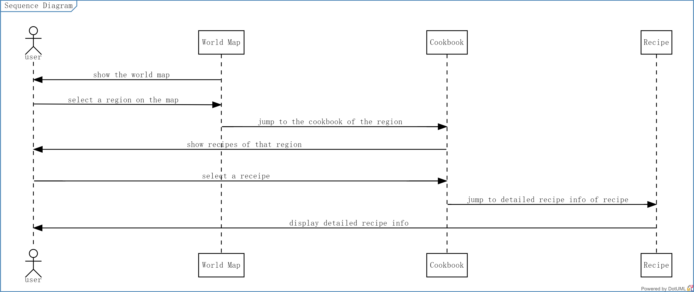
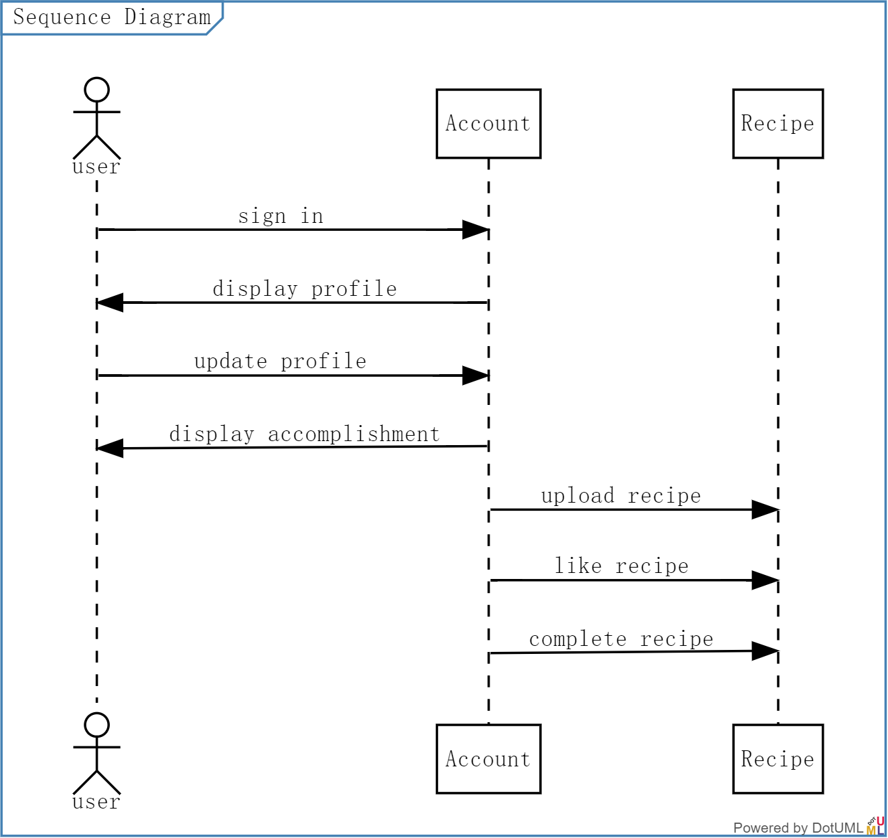
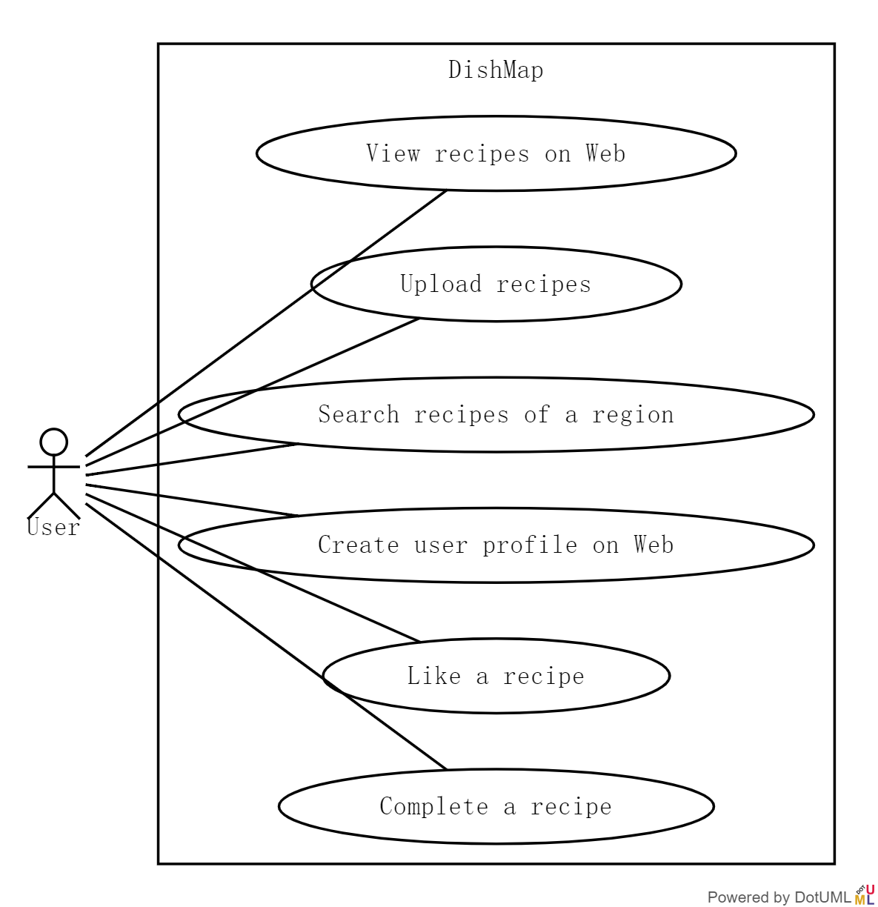
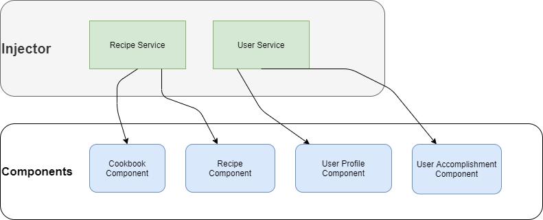
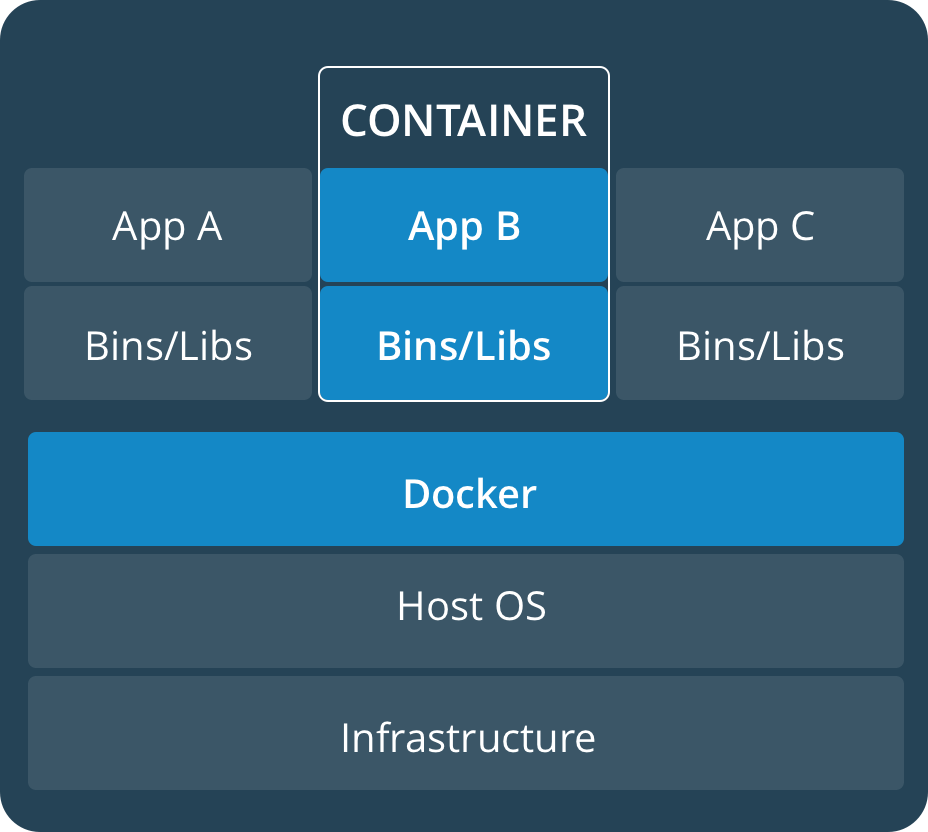
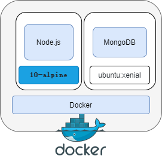

# System Implementation

## Stack architecture and system design

### Mean Stack

Our system apply the [MEAN](https://docs.docker.com/get-started/overview/) Stack.

The MEAN stack is a full-stack, JavaScript-based framework for developing web applications. MEAN stands for **M**ongoDB **E**xpress **A**ngular **N**ode, after the four key technologies that make up the different layers of the stack.

- MongoDB - document database
- Express(.js) - Node.js web framework
- Angular(.js) - a client-side JavaScript framework
- Node(.js) - the premier JavaScript web server

### System Design

#### Data Model

The fundamental part of our data model are **User** class and **Recipe** class. The **id** field of both classes are string type, compatible with database setting.

**User** class stores all information of users.

Field **Token** is an access token. It is used in authentication. After signing in, the user client can get an access token from the server. Whenever users want to access private data, the token will be added into header of HTTP Request, and the server will verify users' identification. 

For the sake of function separation and security, the User class contains three component classes:

| Class              | content                                            | function                   |
| ------------------ | -------------------------------------------------- | -------------------------- |
| UserProfile        | email                                              | Basic user information     |
| UserAccomplishment | likedRecipeId, completedRecipeId, uploadedRecipeId | User accomplishment system |
| UserCredential     | username, password                                 | Authentication             |

 **UserProfile** class stores basic user information. For the time being, it only contains email of users. Other profile like address, phone number and portrait can be added in the future.

**UserAccomplishment** class is designed for accomplishment system, the "playing" part of this app. Users can try achieving all kinds of accomplishment and getting rewards. These accomplishment records are stored in this class.

**UserCredential** class is for Authentication. Data in this class will normally not be directly sent to client for security. It will mainly be use when users sign in their accounts.

**Recipe** Class contains all information to be shown in the Recipe Component and provide a guidance.  **ingredients** and **directions** will tell users what ingredients to prepare and how to deal with them. The **region** field provides a way to classify recipes by region, making the "Dish Map" available.

In order to realize a rank function, **likedNumber** and **completedNumber** fields are added.

#### Sequences

Without signing in, users can find and view recipes. 

The basic operations are like below:

1. **Open the web app:** a huge world map is displayed
2. **Click to select a specific region on the map** or **Click to select a region on the left navigation bar**: the webpage will jump to a cookbook, listing  recipes of that region
3. **click to select a recipe**: The detailed information of recipe (ingredients, directions and so on) will be shown 

After signing in, account-relevant operations are unlocked, including:

- **view and updating user profile**
-  **view accomplishment**
- **upload new recipes**
- **click "favor" button to like a recipe**
- **click "complete" button to complete a recipe**

#### Use Case

To sum up, the use case of our app is like below:

- View recipes on web
- Upload recipes
- Search recipes of a region
- Create user profile on web
- Like a recipe
- Complete a recipe

## Back End - database implementation

## Middle Tier - express, Node, the RESTful API

## Front End - Angular

### Components and Services: Dependency injection

Angular distinguishes **components** from **services** to increase modularity and reusability. 

Ideally, a **component**'s job is to enable the user experience and nothing more. A **component** should present properties and methods for data binding, in order to mediate between the view (rendered by the template) and the application logic (which often includes some notion of a *model*). 

**Services** are injected into **components** to provide data and other services.

Following the sequence diagram above, we have **World Map Component,** **Cookbook Component** and **Recipe Component**. To add features of users, we have extra **User Profile Component** and **User Accomplishment Component**.  Actually we also have other components like **Login Component** and **Register Component** .

Corresponding to our data model, services in our project include **Recipe Service** and **User Service** .

Our components and services are listed below: 

| Components                                                   | Services                                    |
| ------------------------------------------------------------ | ------------------------------------------- |
| World Map, Cookbook, Recipe, User Profile, User Accomplishment, Login, Register, Upload, Layout | Recipe, User, Token-storage, Authentication |

**Recipe Service** get data of recipes from the back end through HTTP Requests, and then give it to the **Cookbook component** and **Recipe Component**. Also, on **Cookbook Component** and **Recipe Component** users can post recipe-relevant data. They can upload new recipes and click "favor" button to like a recipe. 

Similarly, **User Service** can help User **Profile Component** and **User Accomplishment** with data operations concerning user data.

## Authentication

Authentication of our project follows the [given example]([segp/9_User_Authentication.md at main · segp-uob/segp (github.com)](https://github.com/segp-uob/segp/blob/main/dev/Worksheets/9_User_Authentication.md)).

### Authentication Services

### Interceptors

### Token

### 

## Deployment and integration

### Docker

We use [Docker](https://docs.docker.com/get-started/overview/) containers to implement continuous integration and continuous delivery (CI/CD) workflows. 

Docker enables us to separate our applications from your infrastructure so that we can deliver software quickly, and the containers provided by Docker are more lightweight than virtual machines.

When we use Docker, we are creating and using images, containers, networks, volumes, plugins, and other objects. Below is a brief overview of some of those objects from [Docker documentary](https://docs.docker.com/get-started/overview/ ).

#### Images

An *image* is a read-only template with instructions for creating a Docker container. Often, an image is *based on* another image, with some additional customization. For example, you may build an image which is based on the `ubuntu` image, but installs the Apache web server and your application, as well as the configuration details needed to make your application run.

You might create your own images or you might only use those created by others and published in a registry. To build your own image, you create a *Dockerfile* with a simple syntax for defining the steps needed to create the image and run it. Each instruction in a Dockerfile creates a layer in the image. When you change the Dockerfile and rebuild the image, only those layers which have changed are rebuilt. This is part of what makes images so lightweight, small, and fast, when compared to other virtualization technologies.

#### Containers

A container is a runnable instance of an image. You can create, start, stop, move, or delete a container using the Docker API or CLI. You can connect a container to one or more networks, attach storage to it, or even create a new image based on its current state.

By default, a container is relatively well isolated from other containers and its host machine. You can control how isolated a container’s network, storage, or other underlying subsystems are from other containers or from the host machine.

A container is defined by its image as well as any configuration options you provide to it when you create or start it. When a container is removed, any changes to its state that are not stored in persistent storage disappear.

Our project uses 2 Docker Containers, a container for server.js and another container for MongoDB database.

The MongoDB container is directly provided by Docker, and it is based on Ubuntu xenial. The container for server.js is based on 10-alpine. 

#### Volumes and Bind mounts

When a **container** runs, no changes are stored in **image** layer. So when the **container** is deleted, the data will not be kept and move to the new container built on the same **image**. In order to persist the data, either   **Volumes** or **Bind mounts** are needed.

- **Volumes** are stored in a part of the host filesystem which is *managed by Docker* (`/var/lib/docker/volumes/` on Linux). Non-Docker processes should not modify this part of the filesystem. Volumes are the best way to persist data in Docker.
- **Bind mounts** may be stored *anywhere* on the host system. They may even be important system files or directories. Non-Docker processes on the Docker host or a Docker container can modify them at any time.

In order to persist the recipe and user data in the database, we apply the **bind mounts**.

****