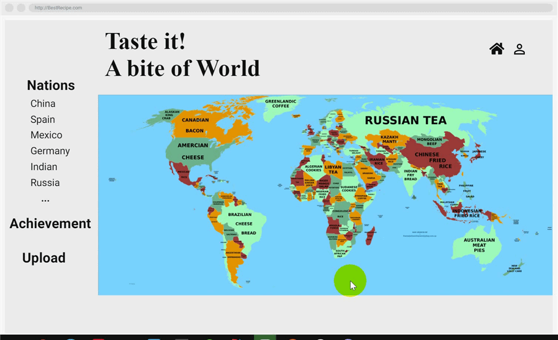

# UX Design

In this section, we discuss the User Experience (UX) design of our app. We start by outlining the design process and ideation and evolution of user interface (UI) design. We then identify our users and stakeholders to provide details regarding their 'stories'.

## Early prototyping and ideation

### Early ideation and mood boards

At first each member of our team came up with their ideas.

|    name     | idea                                                         |
| :---------: | ------------------------------------------------------------ |
|   Wei Wei   | Create a fitness website, provide fitness guidance and customize different fitness programs for different users according to their actual conditions. |
| Wenqing Xie | Create a dish app that allows users to upload share favorite recipes with each other, in addition, according to different countries, provide special recipes for each country. |
| Haolong Li  | Create a interesting game website for children, provide correct guidance for children, and let children learn in the game. |

Then, after the in-depth discussion, we think that the idea of Wei Wei is very good, but most of the fitness guidance documents are charged, and the idea of  Haolong Li technically very difficult to make an interesting and instructive games. More importantly, we think the dish app is very interesting and full of social significance. It can reduce people's cost of living and help people share their favorite recipes with others, so we finally chose this idea. 

We initially identified the functionality through brainstorming. Although in the subsequent website design process we found that many of our early ideas were very naive, and we added new features according to the needs of users, but we have to say that these ideas helped us initially complete the design of the website.

### Paper Prototyping

## Identification of interacting users and broader stakeholders

Most dish websites only regard dish lovers as their end users, but we believe that anyone who hopes to reduce the cost of living, improve the quality of food and share with others also is the target user of our website.

-   **End user - dish lover** The dish lover is a group of people who have much interest in cooking. They may like to study cooking by themselves in their free time and their main tutorial might be materials online. Our website is a good supplement to their self-study. In order to have a deeper understanding of this group, we collected user data of cooking lovers from the similar gourmet website. The data visualization results are as follows.
    
    .jpg?lastModify=1620950211?lastModify=1620952373)
    
    
    
    Obviously，from the perspective of age, most dish lovers are young people, with 24-36 year-olds accounting for the largest proportion, reaching 54%. In addition, from the perspective of gender, dish lovers are mainly female, and the proportion far exceeds that of men.
    
-   **End user - anyone who hopes to reduce the cost of living, improve the quality of food and share with others**
    
    This part of potential users is not convenient for specific statistics, but obviously, the potential number of these users far exceeds the number of dish lovers. This is also one of the original goals of our website: to turn people who were originally not interested in dish into our loyal users.
    
- **Broader stakeholder - sponsor such as kitchenware manufacturers ,food suppliers ...**

Our most important stakeholder is the sponsor of our website. As a dish website, our users need high-quality ingredients and powerful kitchenware. Therefore, we consider cooperating with food suppliers and kitchenware manufacturers to help them sell products. [See future work for details.] In addition, our website is very suitable for interstitial advertising, because the needs of our user groups are very unified and clear, which is conducive to precise customization of suitable products.

A UX approach involves deeply understanding the users through research, organizing information, visual design (and more), all with the goal of meeting user needs and doing it elegantly. It involves putting users at the center of the design and development process, and establishing an iterative cycle of research, design and evaluation.

## UX approach

A [UX approach](https://uxls.org/guide-to-ux/ux-approach-and-principles/) involves deeply understanding the users through research, organizing information, visual design (and more), all with the goal of meeting user needs and doing it elegantly. It involves putting users at the center of the design and development process, and establishing an iterative cycle of research, design and evaluation.

### Design heuristics

A heuristic is a quick, effective way to solve a problem or decide on a particular course of action and [10 Usability Heuristics for User Interface Design](https://www.nngroup.com/articles/ten-usability-heuristics/#poster) is a well-known heuristic standard.

|                         Heuristics                          | description                                                  |
| :---------------------------------------------------------: | :----------------------------------------------------------- |
|               **Visibility of system status**               | The design should always keep users informed about what is going on, through appropriate feedback within a reasonable amount of time. |
|         **Match between system and the real world**         | The design should speak the users' language. Use words, phrases, and concepts familiar to the user, rather than internal jargon. Follow real-world conventions, making information appear in a natural and logical order. |
|                **User control and freedom**                 | Users often perform actions by mistake. They need a clearly marked "emergency exit" to leave the unwanted action without having to go through an extended process. |
|                **Consistency and standards**                | Users should not have to wonder whether different words, situations, or actions mean the same thing. Follow platform and industry conventions. |
|                    **Error prevention**                     | Good error messages are important, but the best designs carefully prevent problems from occurring in the first place. Either eliminate error-prone conditions, or check for them and present users with a confirmation option before they commit to the action. |
|             **Recognition rather than recall**              | Minimize the user's memory load by making elements, actions, and options visible. The user should not have to remember information from one part of the interface to another. |
|            **Flexibility and efficiency of use**            | Shortcuts — hidden from novice users — may speed up the interaction for the expert user such that the design can cater to both inexperienced and experienced users. Allow users to tailor frequent actions. |
|             **Aesthetic and minimalist design**             | Interfaces should not contain information which is irrelevant or rarely needed. Every extra unit of information in an interface competes with the relevant units of information and diminishes their relative visibility. |
| **Help users recognize, diagnose, and recover from errors** | Error messages should be expressed in plain language (no error codes), precisely indicate the problem, and constructively suggest a solution. |
|                 **Help and documentation**                  | It’s best if the system doesn’t need any additional explanation. However, it may be necessary to provide documentation to help users understand how to complete their tasks. |

We used these criteria to conduct a heuristic evaluation of our product's design and we think these regulations can help us complete a more user-friendly website.

### Web design for user

Fortunately, from the previous user survey, more than half of our users are young people. They have strong self-learning ability and are more familiar with most of the operations of the website than the elderly. 

on the one hand, for young users, they are more concerned about beautiful website pages and various cool functions. Therefore, In order to satisfy the user's preferences , in the design of the front end of the website, we deliberately use a lot of beautiful pictures on the website. Young people are generally more willing to share their lives with others. Therefore, our website allows users to upload their own recipes, allows users to support other users' recipes, and adds social features that most dish websites do not have. In addition, we plan to add more social functions and beautiful pictures on the website in our future work.

On the other hand, although the proportion of the elderly among our users is low, we still fully consider the special needs of the elderly. We hope that the elderly can also often use our website. As far as we are concerned, using a gourmet website can not only help them enrich their lives, but also encourage the elderly to share their cooking skills with the youth and increase their communication. This is also in line with the purpose of our project -- simple but with important social significance .Generally, the elderly have less understanding of new technologies such as the Internet, and have poor self-learning ability, so they cannot use websites freely. In order to solve this difficulty, we tried all methods to make our page simple and easy to operate as possible. From the user test from the next part, in the production project of our website, more and more users can use the website smoothly without any guidance.

In a word, our website design is completely user-centric, taking into account the differences in user needs between different groups, and weighing the pros and cons to create a website that satisfies most users.

## User Story

User story is a popular way to record user needs. Now, let's walk into the magical world of Hogwarts and see our cute little wizards' thought.

#### User story -- 1

| Name     | user story                                                   |
| -------- | ------------------------------------------------------------ |
| Harry    | If there is a cool world map on the homepage, it should looks very good. |
| Ron      | Can I upload my favorite food? I think you need to design user module and upload function. |
| Hermione | It seems that the most basic functions of the front-end have been implemented. But the CSS style of the app is too rudimentary.  You need to add CSS styles, and improve the layout of the page on the cookbook page. You may need a grid layout. |

#### User story -- 2

| Name     | user story                                                   |
| -------- | ------------------------------------------------------------ |
| Harry    | This map is awesome, I am satisfied. But why not design it as a route map? How about starting from Bristol? |
| Ron      | This app is getting better, I can not wait to register? What? There is no user model yet? |
| Hermione | I think you need more interactive features, for example, users can add favor to  their favorite recipes. You can also design a ranking to show the most popular recipes |

#### User story -- 3

| Name     | user story                                                   |
| -------- | ------------------------------------------------------------ |
| Harry    | Your web app looks great, but why I can't upload my own recipe? I mean, the website content seems like static. |
| Ron      | The user interaction is so cool! But I'm afraid that my personal account and password is not safe. Maybe you guys can use token for user account certification? |
| Hermione | I'm planning to take a international graduation travel, and want to prepare so cuisine culture. Can I search the recipes by their locations? |

Summarizing the ideas of the three little wizards, we can get a complete set of user requirements, so as to better understand the user group.

## Final Key Subsystem

#### A Huge World Map

### Categories by nations

According to the user needs of Hermione above, we finally successfully achieved categories by different nations. Now, users can choose the recipes of any country according to their preferences. This is a very interesting feature, and we think it can also help people understand the culture of other countries. What's more, we have meticulously beautified the UI interface to satisfy our users' aesthetic needs.

- Click `"Nations"` button to see the different countries' recipes that you are interest in.

### Detail of recipe

From our survey, we found that many users only have vague concepts about recipes. Therefore, we transfer the details of the recipes to the database to help users better use our website. More importantly, in order to enrich the features of the website and meet the social needs of users, we added the function of likes to the website. Now every user gives likes to other people's recipes by the button -- I Like it . Amazing!!!

- Click the recipe's picture to see the details of the recipe.
- Click `"I Like It!"` button to like others' recipes.

### Upload Recipes

According to the user needs of Harry above , there are many users here who hope to upload their own recipes and put their own food on the website. This not only help them meet their social needs but also provide reference and experience for others’ recipes. This is a very meaningful function and we finally succeeded in realizing it.

- Click `"Upload"` button to upload your recipes which is so easy. 

### Achievement

Under the premise of comprehensively considering the needs of users, we finally completed this interesting and meaningful website.

- Click `"Liked"` button to find the recipe that you have liked it.
- Click `"Accomplished"` button to see the recipes' details you have accomplished .
- Click `"Uploaded"` button to see the recipes' details you have uploaded , you may have accomplished but not upload. 

