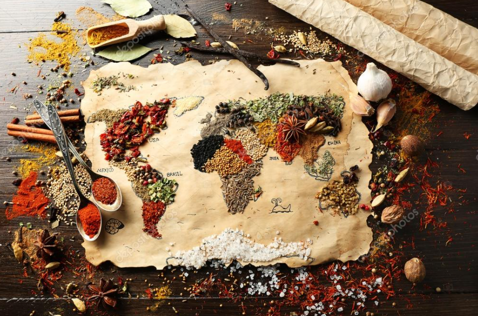
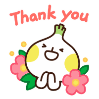

# A Bite of World

## Team And Product's Name

Our team is called **Love and Peace**，which consists of five handsome boys. More importantly, two of them are single！！！

Our product is called **A Bite of World**, it's a single page app (SPA), designed to inspire users in the journey of enjoying food, to feel the gifts from nature, learn the cultures of various countries, strengthen the mutual understanding of users from different cultural backgrounds, enrich people's lives,  reduce people's living costs and make the world full of love and peace.

## Team Member

* Wei Wei       : <fb20165@bristol.ac.uk>
* Haolong Li  : <fr20938@bristol.ac.uk>
* Yifan Luo : <jp20469@bristol.ac.uk>
* Wenqing xie : <es20581@bristol.ac.uk>
* Kaixiang Ma : <da20468@bristol.ac.uk>

## Table of contents

## [1. Introduction](Portfolio/Introduction.md)

This section is comprised of the following subsections:

- Abstract. 
- Project Objectives. 
- Video. 

## [2. Background and Motivation](Portfolio/Background.md)

This section is comprised of the following subsections:

* Background literature
* State of the art survey
* Problem definition
* Motivation

## [3. System Implementation](Portfolio/System_Implementation.md)

This section is comprised of the following subsections:

* Stack architecture and system design
* Back End - database implementation
* Middle Tier - express, Node, the RESTful API
* Front End - Angular
* Authentication
* Deployment and integration

## [4. UX Design](Portfolio/UX_Design.md)

This section is comprised of the following subsections:

* Design Process and Ideation
* Identification of users and stakeholders
* UX approach - design methods
* Understanding user group
* Wireframes and interaction flow diagrams

## [5. Sprints & Project Management](Portfolio/Sprints_Project_Management.md)

This section is comprised of the following subsections:

* Group working methods
* Team roles and contributions
* Documentation of sprints
* Team use of Git

## [6. Evaluation](Portfolio/Evaluation.md)

This section is comprised of the following subsections:

* Evaluation of design
* Unit testing
* User acceptance testing

## [7. Conclusion](Portfolio/Conclusion.md)

This section is comprised of the following subsections:

* Reflection on working practices
* Reflection of successes
* Impact of COVID-19
* Social and ethical implications
* Future work

## Acknowledgments

A big thank you to everyone whose code and libraries we used during this project, referenced above. We are also incredibly thankful for the support and guidance of our lecturers: Stuart Gray, Tom Bale, Pete Bennett, and Marcile Wac. We have learn so much from them, and are excited to implement the skills that they have taught us in our future careers.